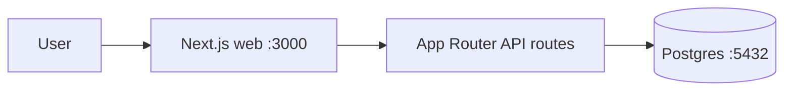

# Architecture: matbao-vibe-challenge

## Stack
- **Frontend + API**: Next.js 15 App Router (TypeScript strict)
- **Database**: Postgres 16
- **ORM**: Drizzle
- **Auth**: NextAuth v5 (optional)
- **Runtime**: Node 22

## Services

| Service | Port | Image | Responsibility |
|---------|------|-------|----------------|
| web | 3000 | node:22-alpine (built từ Dockerfile) | Next.js fullstack |
| db | 5432 | postgres:16-alpine | Primary database |

## Component Diagram



## Data Flow
1. User → web (Next.js server-render hoặc API route)
2. API route → Drizzle ORM → Postgres
3. Response JSON

## Folder Structure

```
app/                    # Next.js App Router
  api/                  # API routes
    health/route.ts     # Health check
  layout.tsx            # Root layout
  page.tsx              # Home page
lib/
  db/
    schema.ts           # Drizzle schema
    index.ts            # DB client singleton
drizzle/                # Generated migrations
docs/                   # Project docs
```

## Key Decisions
- Drizzle thay vì Prisma: lightweight, TypeScript-native, no codegen engine
- Standalone output cho Docker image nhỏ (< 200MB)
- Server Components mặc định — reduce client JS bundle
