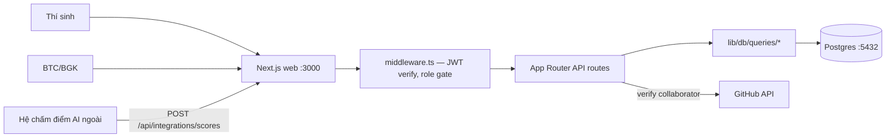

# Architecture: matbao-vibe-challenge

## Stack
- **Frontend + API**: Next.js 15 App Router (TypeScript strict)
- **Database**: Postgres 16
- **ORM**: Drizzle
- **Auth**: JWT tự viết bằng `jose` (KHÔNG dùng NextAuth) — xem "Auth" bên dưới
- **UI**: Design system port từ Vibe Host (`dsvh`) — xem `docs/design.md`
- **Runtime**: Node 22

## Services

| Service | Port | Image | Responsibility |
|---------|------|-------|----------------|
| web | 3000 | node:22-alpine (built từ Dockerfile) | Next.js fullstack |
| db | 5432 | postgres:16-alpine | Primary database |

## Component Diagram



## Auth
- Email/password nội bộ (domain `@matbao.com` bắt buộc khi signup), hash bằng `bcryptjs`.
- Session = JWT ký bằng `jose` (HS256, cookie httpOnly `vcc_token`, 7 ngày).
- **Tại sao `jose` chứ không phải `jsonwebtoken`**: `middleware.ts` chạy Edge runtime,
  không có Node `crypto` — `jsonwebtoken` sẽ crash. `jose` chạy được cả hai.
- Tách `lib/auth/password.ts` (bcrypt, Node-only) khỏi `lib/auth/session.ts` (jose,
  Edge-safe) để middleware không bundle nhầm code Node-only.
- Schema `users` có sẵn `oauthProvider`/`oauthSubject` (nullable) để Phase 2 swap sang
  MS365 OAuth thật mà không đổi schema.
- 3 role: `candidate` / `judge` / `admin`. Middleware chặn candidate vào `/admin/*`.

## Data Flow — luồng chính (3-phase chấm điểm)
1. Thí sinh đăng ký đề tài (`POST /api/submissions`) → BTC duyệt cuốn chiếu, có trần
   `capPerWeek`/tuần (`lib/db/queries/submissions.ts#countApprovedThisWeek`).
2. **Phase 1**: hệ chấm điểm AI ngoài đẩy điểm ý tưởng qua `POST /api/integrations/scores`
   (auth bằng `X-API-Key` = `SCORING_API_KEY`). App CHỈ lưu, không tự chấm.
3. **Phase 2**: thí sinh nộp link Vibe Host + Git repo private
   (`POST /api/submissions/:id/phase2`) → app tự verify GitHub collaborator qua
   `lib/github.ts` (machine-user `matbao-vibe-bot` + `GITHUB_BOT_PAT`) → hệ chấm ngoài
   đẩy điểm kỹ thuật/hoàn thiện → BTC feedback (`needs_fix`/`approved`) → approved thì
   set `kpi3pFlag=true` (app chỉ đánh dấu, không đẩy đi đâu — hệ HRM tự đọc).
4. **CP4**: rà soát an toàn — admin set `securityStatus` (`clean`/`flagged`).
5. **Phase 3**: thí sinh đăng bài Facebook ẩn danh → BGK tick duyệt → admin nhập tay số
   tương tác sau 7 ngày → `lib/scoring.ts#engagementTierFromCount` tự tính bậc 1-4 theo
   trung vị cùng tuần (`getEngagementCohort`).
6. **Công bố**: `POST /api/admin/submissions/:id/publish` tính `finalScore` bằng
   `lib/scoring.ts#computeFinalScore` (40 kỹ thuật + 15 hoàn thiện + 25 ý tưởng + 20 lan
   tỏa, trần kỹ thuật 20 nếu `isPrebuiltRepo`) → set `publishedAt` → hiện trên BXH
   (`listPublishedByBoard`).
7. **CP7 (tuỳ chọn)**: thí sinh gửi phản biện kèm bằng chứng, admin xử thủ công (chưa có
   AI sàng lọc tự động — Phase 2 roadmap).

## Folder Structure

```
app/
  page.tsx                     # Landing công khai (giới thiệu + nút Đăng nhập)
  login/, signup/               # Auth pages
  dashboard/                    # Khu vực thí sinh (bảo vệ bởi middleware)
    register/                   # Đăng ký đề tài (CP2)
    build/                      # Phase 2 — Vibe Host + GitHub
    share/                      # Phase 3 — đăng bài & lan tỏa
    survey/                     # CP6 — phiếu trải nghiệm
    results/                    # Kết quả + phản biện (CP7)
    leaderboard/                # Bảng xếp hạng theo bảng
  admin/                        # Khu vực BTC/BGK (bảo vệ bởi middleware)
    topics/                     # Duyệt đề tài cuốn chiếu
    scoring/                    # Xem/nhập điểm Phase 1-2 + feedback
    security/                   # Cổng CP4
    posts/                      # Duyệt bài Facebook + engagement + công bố
    appeals/                    # Xử lý phản biện
  api/
    auth/{signup,login,logout,me}/route.ts
    submissions/route.ts                          # candidate: tạo/xem đề tài
    submissions/[id]/{phase2,phase3,survey,appeals}/route.ts
    admin/submissions/route.ts                     # list toàn bộ (admin/judge)
    admin/submissions/[id]/{approve,reject,feedback,security,
                             approve-post,engagement,publish,manual-score}/route.ts
    admin/appeals/{route.ts,[id]/route.ts}
    integrations/scores/route.ts                   # hệ chấm điểm ngoài đẩy điểm vào
lib/
  db/
    schema.ts                  # Drizzle schema (7 bảng, xem docs/PRD.md mục 6)
    queries/                   # DB query layer tập trung theo domain
      submissions.ts, scores.ts, appeals.ts, surveys.ts, seasons.ts
    seed.ts                    # Seed dev (pnpm db:seed)
  auth/
    password.ts                # bcrypt — Node-only
    session.ts                 # jose JWT — Edge-safe
  api-auth.ts                  # requireSession() helper cho route handlers
  github.ts                    # verify GitHub collaborator (Phase 2)
  scoring.ts                   # tính bậc lan tỏa + final score (pure functions)
middleware.ts                  # bảo vệ /dashboard/* + /admin/*, role gate
components/
  ui/                          # Component nền tảng port từ dsvh (xem docs/design.md)
  auth-card.tsx, logout-button.tsx
drizzle/                       # Generated migrations
docs/
  reference/                   # Thể lệ v3, wireframe gốc, source dsvh đầy đủ
```

## Key Decisions
- Drizzle thay vì Prisma: lightweight, TypeScript-native, no codegen engine.
- JWT qua `jose` thay vì NextAuth/`jsonwebtoken`: cần Edge-safe cho middleware + dễ swap
  MS365 OAuth ở Phase 2 mà không phụ thuộc 1 thư viện auth framework nặng.
- Không tự chấm điểm/tích hợp Facebook Graph API/tự cấp Vibe Host trong app này — đây là
  quyết định phạm vi đã chốt với user (xem docs/PRD.md mục 7-8), KHÔNG phải thiếu sót.
- `lib/db/queries/*` tập trung mọi câu query — route handlers chỉ gọi hàm, không tự viết
  Drizzle query rải rác (theo convention `CLAUDE.md`).
- Standalone output cho Docker image nhỏ (< 200MB).
- Server Components mặc định — reduce client JS bundle; client component chỉ ở
  form/nút bấm cần state.
